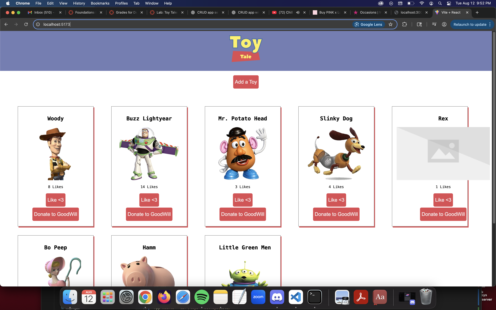
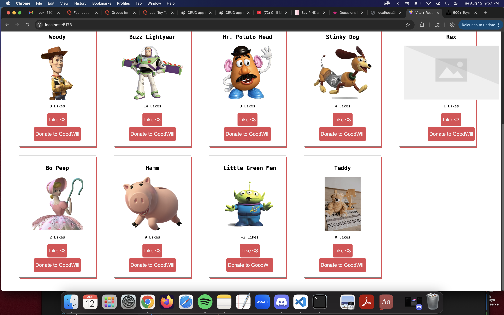
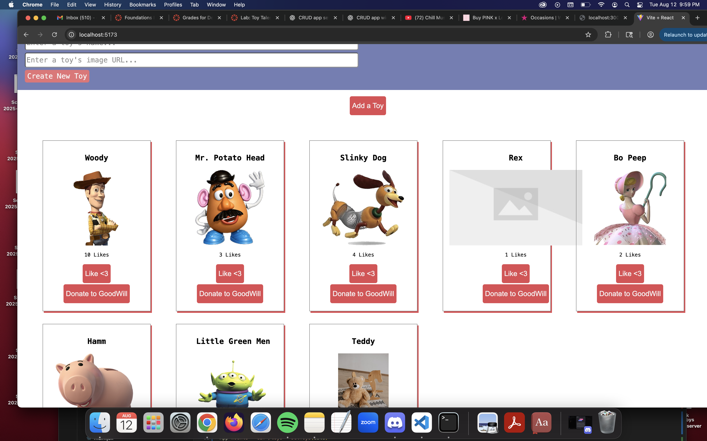

# Toy Tales

React + JSON Server CRUD app. All tests pass with Vitest + Testing Library.

## What it does
- Display toys on load (GET `/toys`)
- Add a toy (POST `/toys`)
- Like a toy (PATCH `/toys/:id`)
- Donate a toy (DELETE `/toys/:id`)

## Run
```bash
npm install
npm run server   # http://localhost:3001/toys
npm run dev      # http://localhost:5173
npm run test

## Screenshots





API
GET    /toys
POST   /toys           { name, image, likes }
PATCH  /toys/:id       { likes }
DELETE /toys/:id

Implementation Notes

App mounts → GET /toys → setToys(data)

Add → form submit → POST /toys { name, image, likes: 0 } → append to state

Like → click “Like <3” → PATCH /toys/:id { likes } → map replace (keeps order)

Donate → click “Donate to GoodWill” → DELETE /toys/:id → filter remove

Project Structure

src/
  components/
    App.jsx           # state, effects, handlers (GET/POST/PATCH/DELETE)
    ToyForm.jsx       # controlled inputs, calls onAddToy
    ToyContainer.jsx  # maps toys -> ToyCard, wires handlers
    ToyCard.jsx       # name, image, "<likes> Likes ", buttons
  __tests__/
    AllToys.test.jsx
    Like.test.jsx
    Donate.test.jsx
    ToyForm.test.jsx
db.json               # JSON Server data

Testing Tips
Run a single file while developing:
npm test -- src/__tests__/AllToys.test.jsx
npm test -- src/__tests__/Like.test.jsx
npm test -- src/__tests__/Donate.test.jsx
npm test -- src/__tests__/ToyForm.test.jsx


## After you take screenshots
```bash
mkdir -p docs
# save images as:
# docs/1-display-toys.png
# docs/2-add-toy.png
# docs/3-like-donate.png
# docs/4-tests.png   # optional

git add docs/*.png README.md
git commit -m "Add screenshots to README"
git push